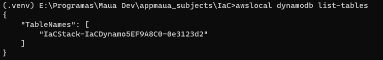

# Template para Fast API

Template de MSS para Fast API.

# Instalação

Comece ao clonar o repositório do modo que achar mais adequado.

## Subir o ambiente de desenvolvimento

### Ir para pasta de infra

    cd IaC

### Subir container de LocalHost:
    docker-compose up -d

### Instalar dependencias do CDK
    npm i -g aws-cdk

### Configurar ambiente virtual:
    py -m venv .venv
    .venv\Scripts\activate
    pip install -r requirements.txt

### Carregar a stack
    cdklocal bootstrap
    cdklocal deploy

### Observar a table do Dynamo criada
    awslocal dynamodb list-tables

### Iniciar server
    uvicorn src.main.main:app --reload

### Rodar testes
    pytest

# Autores
## Grupo Backend (Ordem alfabetica):
    Bruna Galastri Guedes
    Bruno Vilardi Bueno
    Felipe Giusti
    Fernando Oliveira
    Nathan Brito da Silva
    Renan Reschke
    Vitor Martin

# Contribuições
Sendo um projeto fechado para alunos da faculdade Mauá, apenas os alunos podem contribuir para o projeto. 
Para mudanças, edições e outros, ver a seção de Issues e procurar a atividade designada a você.

# Licença
No momento, não há licença. 
